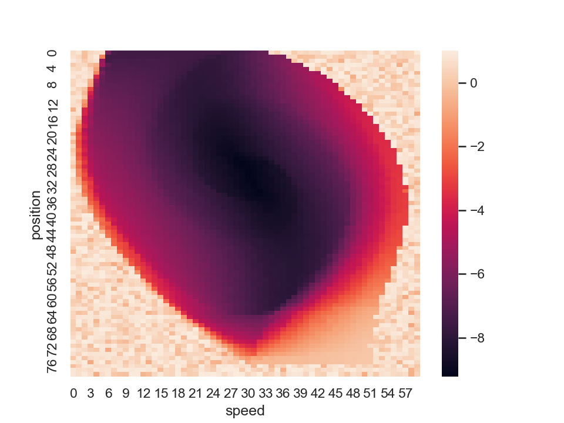

A solution for [mountain car problem](https://gym.openai.com/envs/MountainCar-v0/) via Q-learning with algorithmic and deep approaches.

## Contents
* [Requirements](#requirements)
* [How to run](#how-to-run)
* [DQL results](#dql-results)
* [QL results](#ql-results)

## Requirements
* **PyTorch** ([instructions](https://pytorch.org/get-started/locally/))
* **NumPy** ([instructions](http://www.scipy.org/install.html))
* **gym** ([instructions](https://github.com/openai/gym#installation))
* **seaborn** ([instructions](https://seaborn.pydata.org/installing.html))

## How to run
* Clone this repo to your local computer
* Install all required dependencies
* ???
* Type in console: 
* * `python deep_Q_learning.py` if you want to run deep-approach version
* * `python Q_learning.py` if you want to run algorithmic-approach version
* You're good now

## DQL results
Results with deep approach with following parameters:

* step_amount = 100001
* learning_rate = 0.001
* discount_rate = 0.99
* max_eps = 0.5
* min_eps = 0.1
* batch_size = 256
* sync_models = 1000
* best_step = 69000
* activation = prelu

*Avg reward:*

*Policy, 0 - move left, 1 - do nothing, 2 - move right:*

*Corresponding values:*

## QL results
Results with algorithmic approach with following parameters:

* episode_amount = 40001
* learning_rate = 0.2
* discount_rate = 0.9
* max_eps = 0.5
* min_eps = 0.1
* grid_size = 80 * 60

*Avg reward:*

*Policy, 0 - move left, 1 - do nothing, 2 - move right:*

*Corresponding values:*

